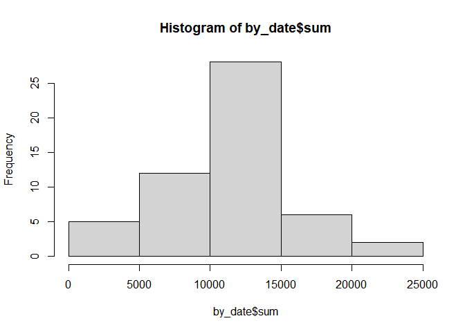
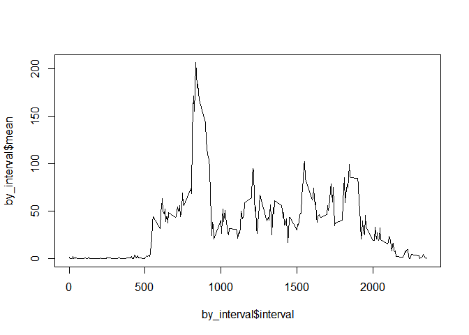
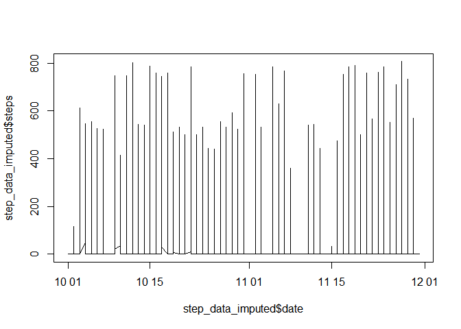
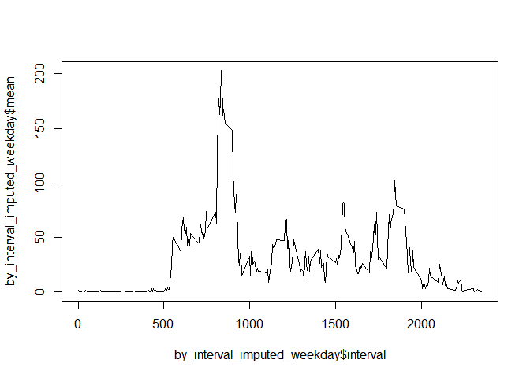
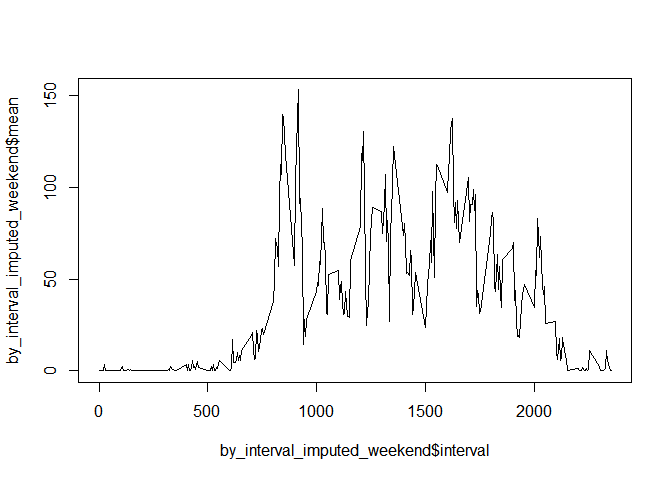

This is course project for coursera reproducible repsearch. This is an
analysis for step data collected by activity monitoring devices such as
a Fitbit, Nike Fuelband, or Jawbone Up.

## Loading and preprocessing the data

This is step data collected by device. It is 5 minute interval through
day. Date of step data is transferred to “date” object.

    library(zoo)
    library(TSstudio)
    library(dplyr)
    step_data<-read.csv("activity.csv")
    step_data$date<-as.Date(step_data$date)
    head(step_data)

    ##   steps       date interval
    ## 1    NA 2012-10-01        0
    ## 2    NA 2012-10-01        5
    ## 3    NA 2012-10-01       10
    ## 4    NA 2012-10-01       15
    ## 5    NA 2012-10-01       20
    ## 6    NA 2012-10-01       25

    setwd("C:/Users/cyj90/github/study/reproducible_research/course_project1")

## Mean total number of steps taken per day

Total number of steps taken per day is formulated as code below.Total
number of step each day table below.

    by_date<-step_data%>%
      group_by(date)%>%
      summarise(
      mean=mean(steps,na.rm=TRUE),
      median=median(steps,na.rm=TRUE),
      sum=sum(steps))
    head(by_date)

    ## # A tibble: 6 x 4
    ##   date          mean median   sum
    ##   <date>       <dbl>  <dbl> <int>
    ## 1 2012-10-01 NaN         NA    NA
    ## 2 2012-10-02   0.438      0   126
    ## 3 2012-10-03  39.4        0 11352
    ## 4 2012-10-04  42.1        0 12116
    ## 5 2012-10-05  46.2        0 13294
    ## 6 2012-10-06  53.5        0 15420

Histogram of total number of steps taken each day is figure below. Ths
most frequent section is from 10,000 to 15,000.

    hist(by_date$sum)

Mean and median of the total number of steps taken per day is calculated
as below.Na value is stripped. Mean and median value is around 10765
steps.

      mean(by_date$sum,na.rm=TRUE)

    ## [1] 10766.19

      median(by_date$sum,na.rm=TRUE)

    ## [1] 10765

## Average daily activity pattern

Mean and median number of steps taken each day is table below.

    by_interval<-step_data %>%
      group_by(interval)%>%
      summarise(
      mean=mean(steps,na.rm=TRUE))
    by_interval

    ## # A tibble: 288 x 2
    ##    interval   mean
    ##       <int>  <dbl>
    ##  1        0 1.72  
    ##  2        5 0.340 
    ##  3       10 0.132 
    ##  4       15 0.151 
    ##  5       20 0.0755
    ##  6       25 2.09  
    ##  7       30 0.528 
    ##  8       35 0.868 
    ##  9       40 0     
    ## 10       45 1.47  
    ## # ... with 278 more rows

Figure below is teime series plot of the 5-minute interval (x-axis) and
the average number of steps taken, averaged across all days (y-axis).

    plot(x=by_interval$interval,y=by_interval$mean,type="l")

Among 5-minute interval on average across all the days, 835 steps
contains maximum number

      head(arrange(by_interval,desc(mean)))

    ## # A tibble: 6 x 2
    ##   interval  mean
    ##      <int> <dbl>
    ## 1      835  206.
    ## 2      840  196.
    ## 3      850  183.
    ## 4      845  180.
    ## 5      830  177.
    ## 6      820  171.

\#\#Imputing missing values Among step data, 2304 data is na value.

    str(filter(step_data,is.na(steps)==TRUE))

    ## 'data.frame':    2304 obs. of  3 variables:
    ##  $ steps   : int  NA NA NA NA NA NA NA NA NA NA ...
    ##  $ date    : Date, format: "2012-10-01" "2012-10-01" "2012-10-01" "2012-10-01" ...
    ##  $ interval: int  0 5 10 15 20 25 30 35 40 45 ...

Step data is imputed with ImputeTS package. Time series plot of step
data is figure below.

      library(imputeTS)
      step_data_imputed<-step_data
      step_data_imputed$steps<-na_interpolation(step_data_imputed$steps)
      plot(x=step_data_imputed$date,step_data_imputed$steps,type="l")

    by_date_imputed<-step_data_imputed %>%
      group_by(date)%>%
      summarise(
      mean=mean(steps,na.rm=TRUE),
      median=median(steps,na.rm=TRUE),
      sum=sum(steps))
    head(by_date_imputed)

    ## # A tibble: 6 x 4
    ##   date         mean median   sum
    ##   <date>      <dbl>  <dbl> <dbl>
    ## 1 2012-10-01  0          0     0
    ## 2 2012-10-02  0.438      0   126
    ## 3 2012-10-03 39.4        0 11352
    ## 4 2012-10-04 42.1        0 12116
    ## 5 2012-10-05 46.2        0 13294
    ## 6 2012-10-06 53.5        0 15420

Mean and median of the total number of steps taken per day with
imputation is calculated below. The value is quite different comparing
to value without impuation whose mean is 10766.19 and median is 10765.

    mean(by_date_imputed$sum)

    ## [1] 9354.23

    median(by_date_imputed$sum)

    ## [1] 10395

\#\#Differences in activity patterns between weekdays and weekends Step
data is arranged by weekend and weekdays. Step data of weekdays is table
below.

    step_data_imputed$weekdays<-weekdays.Date(step_data_imputed$date)
      step_data_imputed_weekday<-filter(step_data_imputed,weekdays=="월요일" | weekdays=="화요일" | weekdays=="수요일"  | weekdays=="목요일"  | weekdays=="금요일")
      step_data_imputed_weekend<-filter(step_data_imputed,weekdays=="토요일" | weekdays=="일요일")
      head(step_data_imputed_weekday)

    ##   steps       date interval weekdays
    ## 1     0 2012-10-01        0   월요일
    ## 2     0 2012-10-01        5   월요일
    ## 3     0 2012-10-01       10   월요일
    ## 4     0 2012-10-01       15   월요일
    ## 5     0 2012-10-01       20   월요일
    ## 6     0 2012-10-01       25   월요일

Step data of weekend is table below.

    head(step_data_imputed_weekend)

    ##   steps       date interval weekdays
    ## 1     0 2012-10-06        0   토요일
    ## 2     0 2012-10-06        5   토요일
    ## 3     0 2012-10-06       10   토요일
    ## 4     0 2012-10-06       15   토요일
    ## 5     0 2012-10-06       20   토요일
    ## 6     0 2012-10-06       25   토요일

Step data is factored to weekdays and weekend.

    weekdays1<-c('월요일', '화요일', '수요일', '목요일', '금요일')
    weekend1<-c('월요일', '화요일', '수요일', '목요일', '금요일')
    step_data_imputed$ifweekday<-factor(step_data_imputed$weekdays %in% weekdays1,levels=c(FALSE, TRUE), labels=c('weekend', 'weekday'))
    head(step_data_imputed)

    ##   steps       date interval weekdays ifweekday
    ## 1     0 2012-10-01        0   월요일   weekday
    ## 2     0 2012-10-01        5   월요일   weekday
    ## 3     0 2012-10-01       10   월요일   weekday
    ## 4     0 2012-10-01       15   월요일   weekday
    ## 5     0 2012-10-01       20   월요일   weekday
    ## 6     0 2012-10-01       25   월요일   weekday

      step_data_imputed_weekday<-filter(step_data_imputed,ifweekday == "weekday")
      step_data_imputed_weekend<-filter(step_data_imputed,ifweekday == "weekend")

Time series plot of the 5-minute interval (x-axis) and the average
number of steps taken (y-axis) in weekdays is figure below.

    by_interval_imputed_weekday<-step_data_imputed_weekday %>%
      group_by(interval)%>%
      summarise(
      mean=mean(steps,na.rm=TRUE))

    by_interval_imputed_weekend<-step_data_imputed_weekend %>%
      group_by(interval)%>%
      summarise(
      mean=mean(steps,na.rm=TRUE))

    plot(x=by_interval_imputed_weekday$interval,y=by_interval_imputed_weekday$mean,type="l")

Time series plot of the 5-minute interval (x-axis) and the average
number of steps taken (y-axis) in weekend is figure below.

    plot(x=by_interval_imputed_weekend$interval,y=by_interval_imputed_weekend$mean,type="l")

